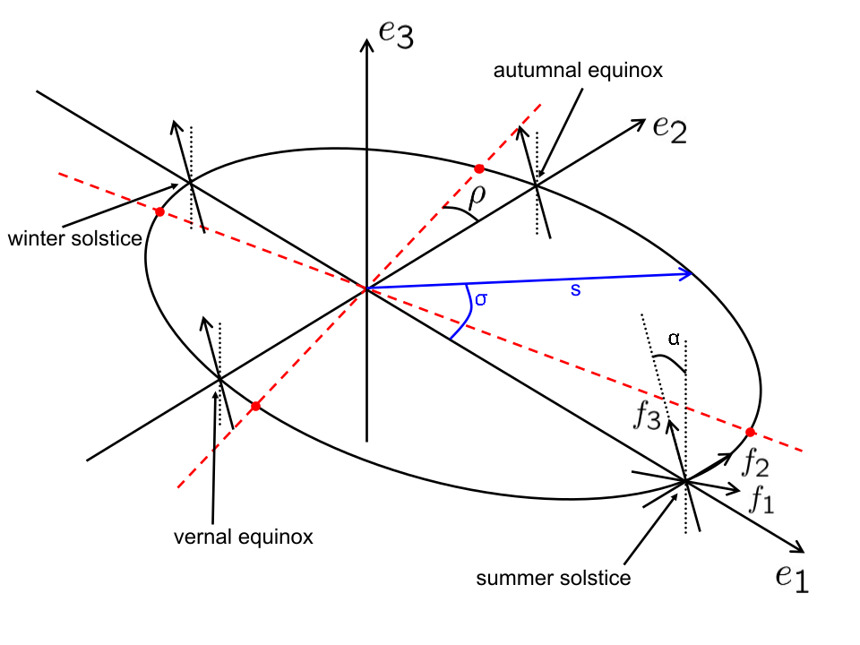
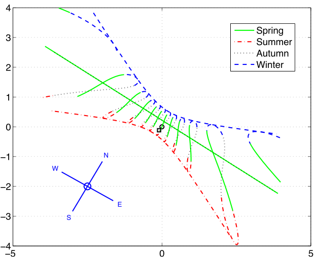

# The sundial problem from a new angle

Latest version of a paper [originally published](https://iopscience.iop.org/article/10.1088/0143-0807/27/2/023) in the [European Journal of Physics](https://iopscience.iop.org/journal/0143-0807) in 2006.

  
   

Download PDF: [The sundial problem from a new angle - Russell Goyder.pdf](<The sundial problem from a new angle - Russell Goyder.pdf>)

[LaTeX source and figures in GitHub](https://github.com/russellgoyder/sundial-latex)

Dusted off and presented in [part 1](https://youtu.be/gO77fMRwn5E) and [part 2](https://youtu.be/w6-A_uJp15M) of a [metauni seminar](https://metauni.org/anythingatall/).

### Building from LaTeX source

To build, run `latexmk -pdf`. To clean up, `latexmk -C` and if you want, `find figs -name 'figure?.eps-converted-to.pdf' | xargs rm`.

#### Note

Fixed a typo in figure 3 (DialFrame.fig) using inkscape which couldn't save as fig, so I saved it as DialFrame.svg.

[![CC BY 4.0][cc-by-shield]][cc-by]

This work is licensed under a
[Creative Commons Attribution 4.0 International License][cc-by].

[![CC BY 4.0][cc-by-image]][cc-by]

[cc-by]: http://creativecommons.org/licenses/by/4.0/
[cc-by-image]: https://i.creativecommons.org/l/by/4.0/88x31.png
[cc-by-shield]: https://img.shields.io/badge/License-CC%20BY%204.0-lightgrey.svg